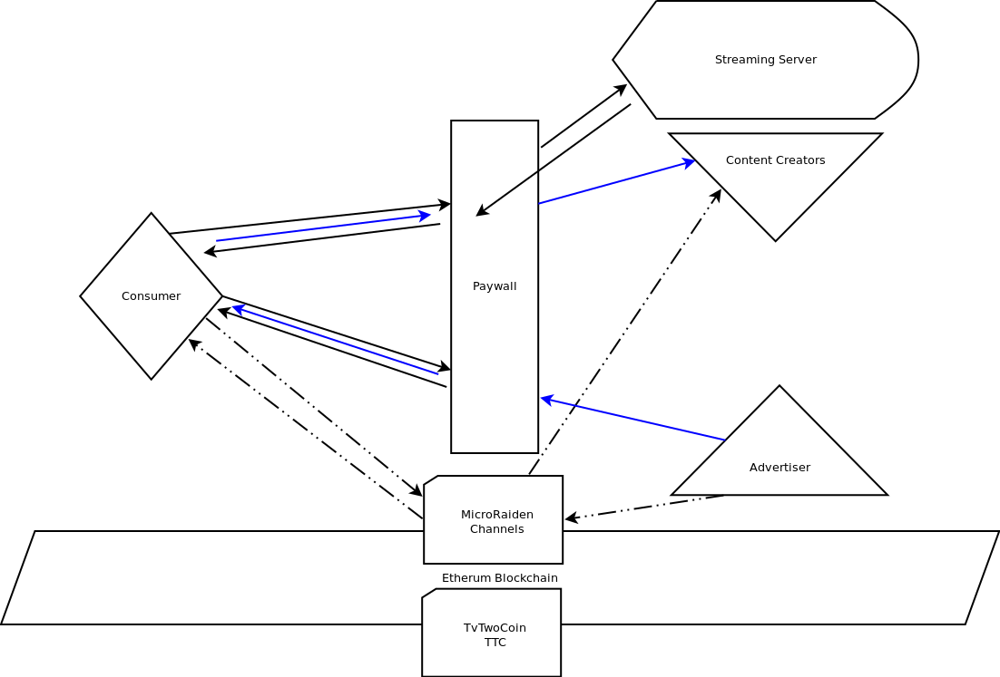

# MicroRaiden is a many to one off-chain payment solution.

## general principle

A certain amount of a ERC20 token gets locked into the microRaiden contract in order to open a payment channel,
they will be released once this channel is settled.

* tokenFallback : in order to create or topup a channel, someone can ```transfer``` tokens to the channelManager, 
  alongside data about the recipient and in case of topping up the opening block of the corresponding 
  channel.

* Create or Top Up a Channel : it is possible to set the allowance for the channel manager to a 
  certain amount, and then call `createChannel` or `topUp`.
  
* Delegate : a trusted smart-contract can call `createChannelDelegate` or `topUpDelegate` in order to 
  create a channel. This will fail if the allowance of the trusted contract's token account is not 
  high enough.

* Cooperative Close : The channle can be closed by providing a valid balance-proof signed by the spender and
  a closing_signature signed by the recipient

* Uncooperative Close : or the spender can just claim a certain balance, what will trigger a grace 
  period in which the recipient can provide a balanceProof signed by the spender. After the grace 
  period the spender can call `settle` to execute the token transfers accordingly.

* Withdraw : The recipient can always withdraw tokens, providing a valid balanceProof signed by the spender


## idea of an implementation



### the Consumers Perspective

The receiver, in our case the video platform, runs a proxy server,
that can Sign balance_proofs and serve payable content.

The Consumer opens a channel where ttc are deposited to view original content.
This can be done by TvTwo if the account is ```managed```.

While the proxy opens a channel with the Consumer to pay for Ads.

The viewer has incentive to accept tokens for viewing adds, which can be offered
once an ad had been downloaded. This means a balance_proof is signed by the paywall 
and published.(sent to the Viewing App where it is saved in order to withdraw the 
tokens when convenient, in order of fairness we should provide a service to reRequest 
those proofs)

The viewer has to send tokens to the uRaiden Paywall Proxy in order to be able to view the content,
which means he signes a balance_proof, the paywall checks it's validity cryptographicly corectness, 
and balance deltas compared to the price of the content). 
We can then withdraw the tokens if we need them as long as we can provide the lates balanceProof.

If the viewer closes the channel we receive the tokens automaticly.

We have to watch out for uncooperative Close events and hand in balanceProofs if we do not agree with 
them

### the managed flag

- When creating a new account with TvTwo, a user will provide it's Ethereum Address, and TvTwo can 
  call createViewer in order to set the ```managed``` flag. 
  This will fail, if the address owns any TTC.

- If an account is managed TvTwo can call deposit, to open a payment channel to the current paywall 
  address only. If TvTwo would exchange the channelManager for some malicous Wallet Contract, it would 
  be possible to steal all managed tokens, but the platform would be broken and TTC worthless.

- If a user wants to set the managed flag, it is possible to call setManaged and become managed or 
  unmanaged. Then the tokens owned won't be accessible anymore.
  
- TvTwo and everybody else can settle channels when a valid balance_proof and a 
  valid closing signature can be provided.
  In case of a consumer's receveing channel the the balance_proof will be in TvTwo's possession
  and the closing_signature can be generated using the paywalls private key.
  

Then the consumer will receive ttc without ever owning any ether.
  
-  A managed user can still settle channels, transfer tokens and everything else a non managed user 
   can do. It is imaginable that a viewer might transfer tokens to another not managed address to
   keep them save.


### the contentCreators perspective

The Paywall would open a channel to every contentCreator, when any Consumer pays for any content, we create a balanceProof
with the updated balance for this contentCreator, that is published/sent to the contentCreaotor in any way.

* We would have to deposit tokens for the contentCreators in advance and 
* the contentCreator would have to trust us that we pay according to the ToS.

### the advertisers perspective

the advertiser would have no incentive to pay once its ad has been watched, therefor an advertiser would pay in 
advance trusting us that we view its ad or repay him according to the ToS.

* the Advertiser opens a channels with us and signes a balanceProof or just transfers tokens to us directly.
* When we need tokens we can withdraw tokens from that channel.
* we have to keep an off-chain database of balances for ads, in sync with all the views and balanceProofs

### TvTwos perspective

We have to keep record of balanceProofs, the paywall server contains one or several private keys to ethereum addresses, 
to sign balanceProofs, if one gets into the wrong hands all tokens in all its channels can be stolen.

* Advertisers and ContentCreators would have to trust us that we are fair

* Most of the busines logic lives in the paywall a traditional server, and we are in control 
of flow of TvTwoCoins, besides traditional trading.

* We can in regular intervalls, publish hashes of our protocls on the blockchain(ipfs links for example) and publish them.
  that would make our doings transparent, and whover wants to put in the effort can check if they are screwed over.
  We are still the authority generating and signing the server logs/protocolls but we can't alter the already published logs,
  since that would result in a differnt hash value that the one that is savely and publicly stored on chain.
  
## conclusion

I think implementing this Smart Contract wise is easy,

But many things the TvTwoManager was expected to handle are now part of the paywall.

If you look at the graphic, you see that everything is very centralized around the paywall.
But if we deliver streaming content the only source of truth about who watched what is the server
delivering them.


the uRaiden-Proxy software seems to be a bit flimsy,
all examples ended up in some unusable states after some experimenting wiht them.
I expect this to improve in the near future.

